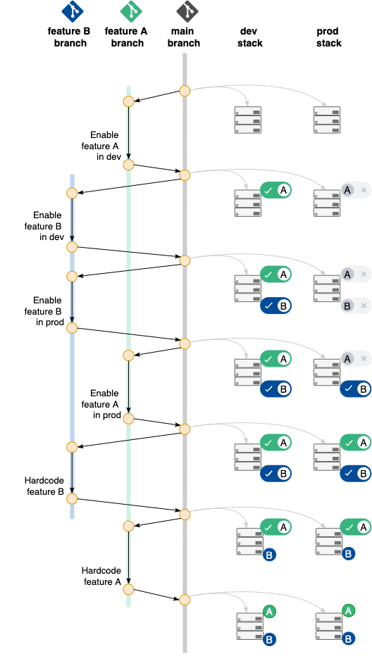
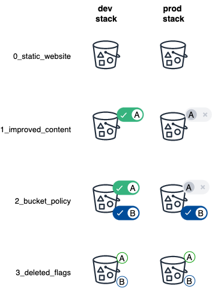

# Feature Flags (AKA Toggles) with Pulumi

This repository demonstrates how to implement feature flags with a minimal AWS Python Pulumi infrastructure-as-code program. 

The repository exploits the Pulumi configuration system to deploy stacks with optional features while maintaining a single source code branch:

The repository uses a simple S3 static website example with two features and two stacks:

For more details please refer to the [accompanying article](https://medium.com/@soumaya-mauthoor/feature-flags-with-pulumi-df578fc9ea43).

## Optional Instructions

Please follow these steps to provision the infrastructure in this repository:

1. Set up Pulumi and AWS access as explained on the [tutorial](https://www.pulumi.com/docs/get-started/aws/begin/)
2. Checkout this GitHub repository
3. Create and activate a python environment based on the `requirements.txt`
4. Login to your preferred Pulumi [backend](https://www.pulumi.com/docs/intro/concepts/state/)
5. cd into each directories in order and `pulumi up` on all stacks
6. Don't forget to `pulumi destroy` all stacks once you're done!
